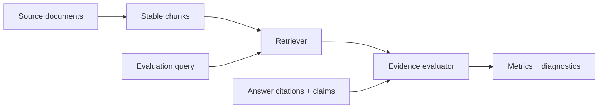

# Evidence RAG

[](https://github.com/bryllim/evidence-rag/actions/workflows/ci.yml)

A compact evaluation toolkit for retrieval-augmented generation systems, centered on citation validity, evidence coverage, retrieval quality, and regression testing.

> Reference implementation published in 2026. The commit history reflects the actual build and publication timeline.

## Why it exists

RAG quality cannot be reduced to whether an answer sounds good. Evidence RAG treats retrieval and grounding as measurable contracts and produces diagnostics that teams can use in CI.

## Architecture



The built-in BM25-style retriever is a deterministic baseline, not a claim that lexical search is sufficient. The evaluator is adapter-friendly: it consumes ranked hits, expected evidence, answer citations, and claim-to-evidence mappings.

## Quick start

```bash
python -m pip install -e .
evidence-rag-demo
```

```python
from evidence_rag import Document, EvaluationCase, LexicalRetriever, RAGEvaluator, chunk_document

document = Document("policy", "Refunds are accepted within 30 days.", "policy.md")
hits = LexicalRetriever(chunk_document(document)).search("refund window")
case = EvaluationCase(
    query="refund window",
    expected_chunk_ids=frozenset({"policy:0"}),
    cited_chunk_ids=("policy:0",),
    claim_evidence={"window": frozenset({"policy:0"})},
)
report = RAGEvaluator().evaluate(case, hits)
assert report.passed
```

## Metrics

| Metric | Question answered |
|---|---|
| Recall@k | Did retrieval include the expected evidence? |
| Reciprocal rank | How early did the first relevant chunk appear? |
| Citation precision | Do citations point to retrieved context? |
| Claim coverage | Does every assessed claim cite supporting evidence? |
| Pass/fail gate | Does the case satisfy configured regression thresholds? |

See [the architecture notes](docs/architecture.md) for evaluation boundaries and production extensions.

## Verification

```bash
PYTHONPATH=src python -m unittest discover -s tests -v
```

## Status

The initial release includes a deterministic lexical retriever and offline evaluation primitives. It is designed to be easy to replace with production search adapters.

## License

MIT
